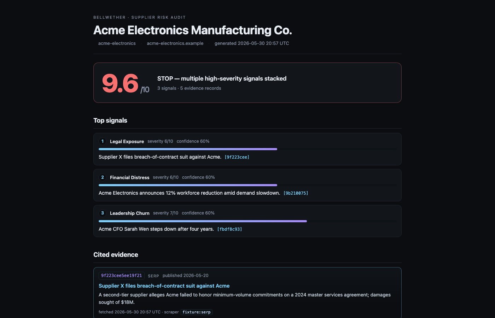

# Bellwether

> A morning agent that watches your supplier list, surfaces operational and
> reputational risk from the live web, and files an audit-grade review ticket
> in your CRM — autonomously, with every claim cited.

**Hackathon:** Web Data UNLOCKED · lablab.ai (May 25–30, 2026), SF finale May 30–31.
**Author:** Subhendu Das — solo build, no team.
**Live demo:** <https://bellwether-demo.vercel.app/acme>



The name *Bellwether* is what procurement teams call the supplier whose
behavior signals the herd. The product turns that idea inside out: a bellwether
*for* your suppliers, ringing the bell before a delivery slips.

### Try the demo

The demo deploys static audit pages for three fictional suppliers, one per
risk state. No login, no setup — open and click:

| URL | What you'll see |
| --- | --- |
| [`/`](https://bellwether-demo.vercel.app/) | Morning dashboard — all three suppliers, sorted by score |
| [`/tranquil`](https://bellwether-demo.vercel.app/tranquil) | **STOP** (10.0) — sanctions hit; severity-1 ticket would auto-file |
| [`/acme`](https://bellwether-demo.vercel.app/acme) | **Watch** (9.6) — legal + financial + leadership signals stacked |
| [`/bluewave`](https://bellwether-demo.vercel.app/bluewave) | **Quiet** (0.0) — no change today, one-line memo |

Every score on every page is hyperlinked to the underlying evidence record
(SERP result, LinkedIn snapshot, OFAC entry), with the Bright Data fetch
timestamp shown — judges can audit any claim in two clicks.

---

## What it does

Every morning at 06:00 local, Bellwether:

1. Reads the supplier list from packaged demo fixtures or a HubSpot tenant.
2. For each supplier, queries the live web through Bright Data — SERP and
   LinkedIn — and caches every response with provenance.
3. Fetches the OFAC SDN list directly from Treasury and runs a deterministic
   match — Granite is never allowed to *decide* a sanctions hit.
4. Hands the rest of the evidence to an IBM Granite model on AMD MI300X to
   extract structured risk signals (with a regex MockExtractor fallback when
   the GPU is cold).
5. Scores the supplier with deterministic Python (the math is auditable in
   ~40 lines), then writes a one-page Markdown memo with every score
   hyperlinked to its source.
6. Files a *Supplier Review* ticket in the buyer's HubSpot tenant and assigns
   the account owner — via the REST API, with Perplexity Comet driving the same
   flow in-browser when its session token is set.

If a supplier is quiet, the memo is a one-line "no change." If a sanctions hit
lands, the ticket is opened at severity-1 within minutes of the source list
updating.

### Status (2026-05-30)

| Step                            | State                                       |
| ------------------------------- | ------------------------------------------- |
| Bright Data evidence collectors | Live + fixture mock                         |
| OFAC sanctions lookup           | Direct (CSV-parsed, async + day-cached)     |
| Granite extractor (MI300X)      | Live + regex MockExtractor                  |
| Deterministic scorer            | Live + test-pinned                          |
| Markdown memo with citations    | Live                                        |
| Auditor view (HTML)             | Live + per-supplier + morning index page    |
| CrewAI orchestration            | Live; falls back to sequential pipeline     |
| HubSpot ticket filer            | Live; attaches memo .md, assigns owner      |
| Perplexity Comet driver         | Gated by session token; REST fallback ready |

---

## The stack

| Layer            | Tool                            | Why it's here                         |
| ---------------- | ------------------------------- | ------------------------------------- |
| Live web data    | Bright Data (SERP, LinkedIn, Web Unlocker) | Fresh evidence on private companies, with provenance per record |
| Model hosting    | AMD MI300X + ROCm + vLLM        | Free inference under sponsor credits; vLLM gives strict JSON-mode for structured extraction |
| Extraction model | IBM Granite 3.1 8B Instruct     | Cheap, strong at JSON-mode extraction |
| Orchestration    | CrewAI                          | Four-agent crew per supplier (Researcher / Compliance / Analyst / Writer) |
| Last-mile action | Perplexity Comet                | Drives the CRM the way a human would — REST fallback always available |
| Demo CRM         | HubSpot (free tier)             | Lowest-friction enterprise surface    |

The public repo keeps the implementation, fixtures, tests, and demo assets in
one place. Private signup notes, local tokens, and pitch rehearsal material stay
outside the repository.

---

## Layout

```
Bellwether/
├── README.md              ← this file
├── pyproject.toml         ← installable as `bellwether` (pip install -e .)
├── tests/                 ← pytest — pin the scorer's behavior
└── src/bellwether/
    ├── __init__.py
    ├── config.py          ← loads environment variables / sibling keys/.env
    ├── cli.py             ← `bellwether {run,suppliers,view,ping,verify}`
    ├── runner.py          ← collect → extract → score → memo (via crew/)
    ├── health.py          ← provider health checks behind `bellwether ping`
    ├── models.py          ← Pydantic: Supplier, EvidenceRecord, RiskSignal, …
    ├── evidence/          ← Bright Data client, SERP/LinkedIn/OFAC collectors, disk cache
    ├── extract/           ← Granite vLLM client + offline MockExtractor
    ├── score/             ← deterministic weighted-sum scorer
    ├── memo/              ← Markdown memo writer with cited sources
    ├── crew/              ← CrewAI four-agent orchestrator (Researcher / Compliance / Analyst / Writer)
    ├── hubspot/           ← Private-App REST client — list suppliers, file tickets, attach memos
    ├── comet/             ← Perplexity Comet driver — browser-driven CRM action with REST fallback
    ├── auditor/           ← HTML audit pages + dashboard for the demo
    ├── mcp/               ← MCP server — exposes the latest cited memo to Claude Desktop / Cursor
    └── fixtures/          ← demo suppliers + seeded evidence for --mock runs
```

Secrets are kept **outside** this folder on purpose. Live mode expects either
exported environment variables or a sibling `keys/.env` file one directory above
the repo; `.env` files are gitignored. This keeps the public submission safe to
zip or push without token leaks or working-doc noise.

---

## Run it

```bash
# from Bellwether/
python3.12 -m venv .venv && source .venv/bin/activate
pip install -e .                                # registers `bellwether` CLI

# Offline — runs against packaged fixtures, no tokens needed
bellwether suppliers                            # list demo suppliers
bellwether run --supplier acme-electronics --mock
bellwether run --all --mock                     # full morning batch

# Live — needs environment variables or a sibling ../keys/.env
bellwether verify                               # show missing tokens
bellwether run --supplier acme-electronics      # live Bright Data + Granite

# Tests
pytest tests/ -q
```

Memos land in `./memos/<supplier>-<date>.{md,json}`. Cached Bright Data
responses land in `./.cache/evidence/<id-prefix>/<id>.json`. Both are
gitignored.

The build landed in roughly three hours of focused work; the repo is scoped to
the runnable submission artifact.
